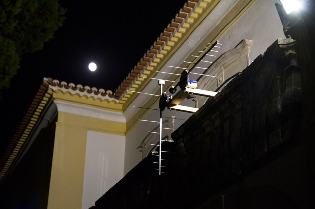
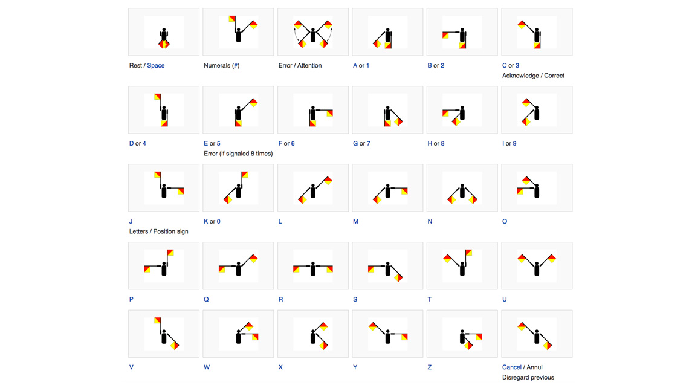

#Tweeting Antennas

###Developed by [Ivan Vuksanov](http://ivanvuksanov.com/) and Francisco Salgado

##Summary
"Tweeting Antennas is a site-specific installation that explores the relationship between new and old media in today’s hybrid public spaces.

It proposes to render visible the digital communication processes that are usually invisible. In particular, it translates geo-located tweets into the real-time movement of a roof TV antenna. For each alphabetic character the antenna moves into the corresponding position of the Flag Semaphore System. The project is the outcome of a research on the relationships between people and technology in the urban space."

Read more at [http://ivanvuksanov.com/project/tweeting-antennas/](http://ivanvuksanov.com/project/tweeting-antennas/).

 

##Description
Code runs on Processing on a computer with access to the internet and connected to an Arduino.
Uses Twitter API to fetch latest tweets near the installation or containing the keyword (plunc). The content of each tweet is then striped to only the useful information and displayed with the help of a pair of flags moved with stepper-motors.

Each character of the message to display is displayed through Semaphore Flags encoding.

####Libraries Required for Processing
oauthP5
